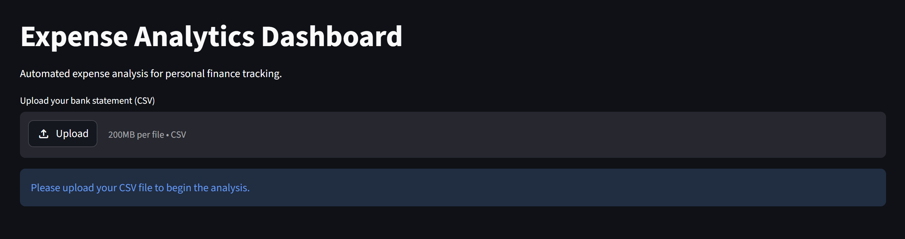
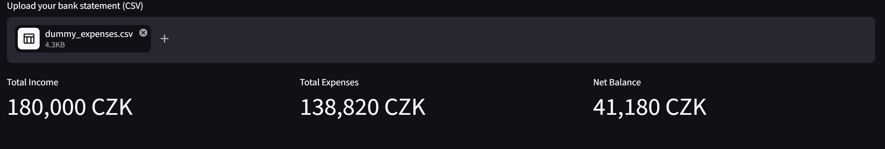
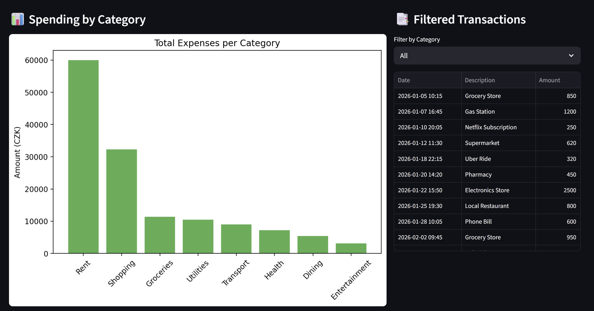
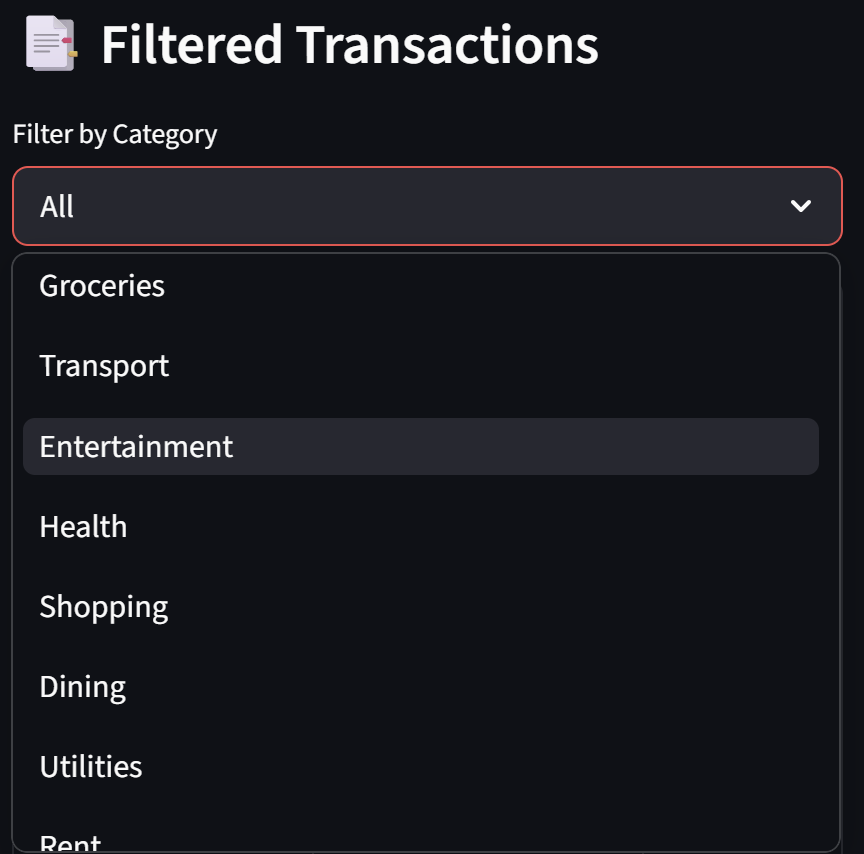

# Expense Analytics Dashboard

Interactive dashboard for analyzing and visualizing expense data from CSV files.

Built with Python, Pandas, Matplotlib, and Streamlit.

---

## Features

- CSV expense data upload
- Automated expense categorization
- Monthly spending analysis
- Interactive charts and visualizations
- Simple and responsive dashboard UI

---

## Tech Stack

- Python
- Pandas
- Matplotlib
- Streamlit

---

## Screenshots

### Dashboard Overview
<p align="center">
  
</p>

### Income and Expense Balance
<p align="center">
  
</p>

### Expense Charts
<p align="center">
  
</p>

### Showcase Filters
<p align="center">
  
</p>

---

## Installation & Setup

```bash
# Clone repository
git clone [https://github.com/michal-brozovsky/expense-analytics-dashboard.git](https://github.com/michal-brozovsky/expense-analytics-dashboard.git)

# Navigate into project
cd expense-analytics-dashboard

# Create virtual environment
python -m venv venv

# Activate virtual environment

# Windows
venv\Scripts\activate

# macOS/Linux
source venv/bin/activate

# Install dependencies
pip install -r requirements.txt

#Run application
streamlit run app.py
```

Sample Dataset
The repository includes a sample CSV dataset (dummy_expenses.csv) for testing the dashboard.

Future Improvements
Database Integration: Move from temporary CSV file uploads to a persistent database storage (SQLite / PostgreSQL).

AI-Powered Categorization: Integrate OpenAI API to automatically predict and assign categories based on transaction descriptions.

User Authentication: Implement a secure login system so multiple users can manage their private data.

Automated Alerts & Reports: Add automated email notifications for budget limits and monthly PDF financial summaries.

Advanced Filtering: Add custom date ranges and multi-currency support.